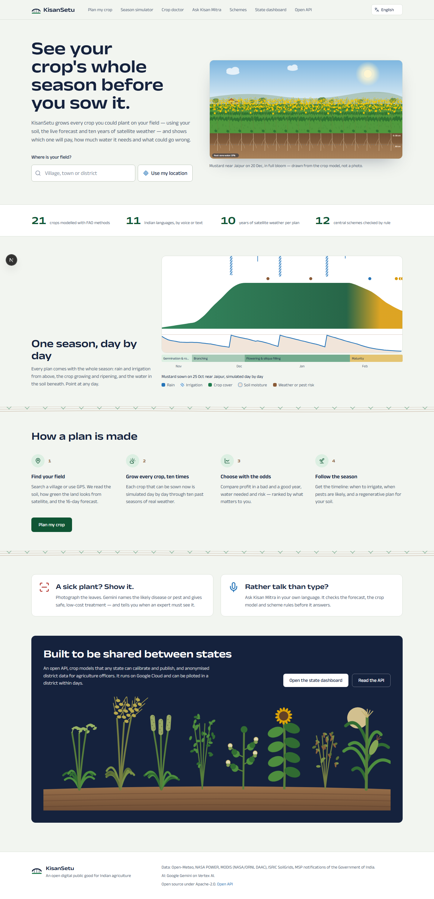
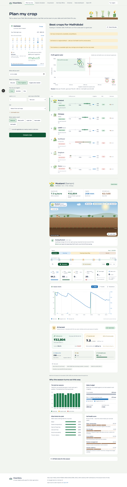
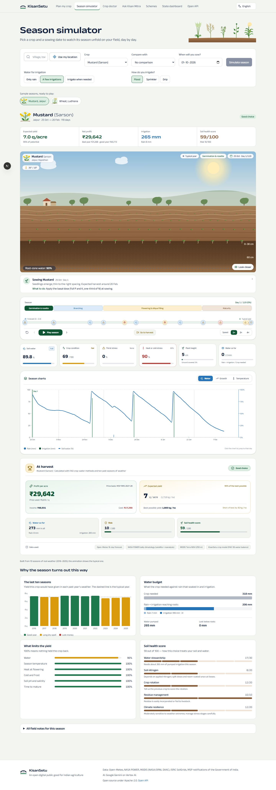
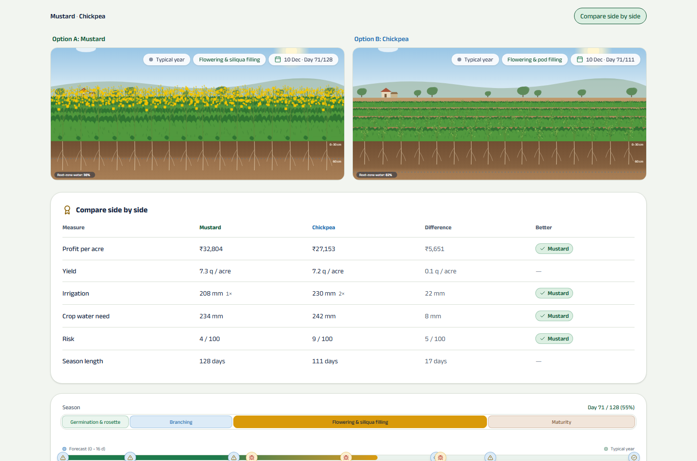
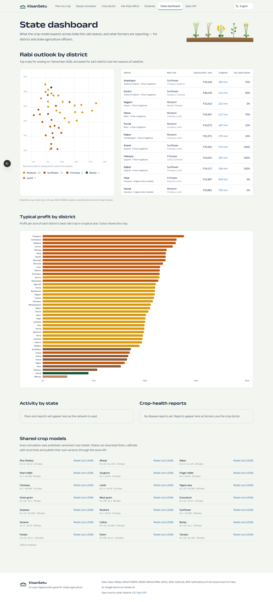
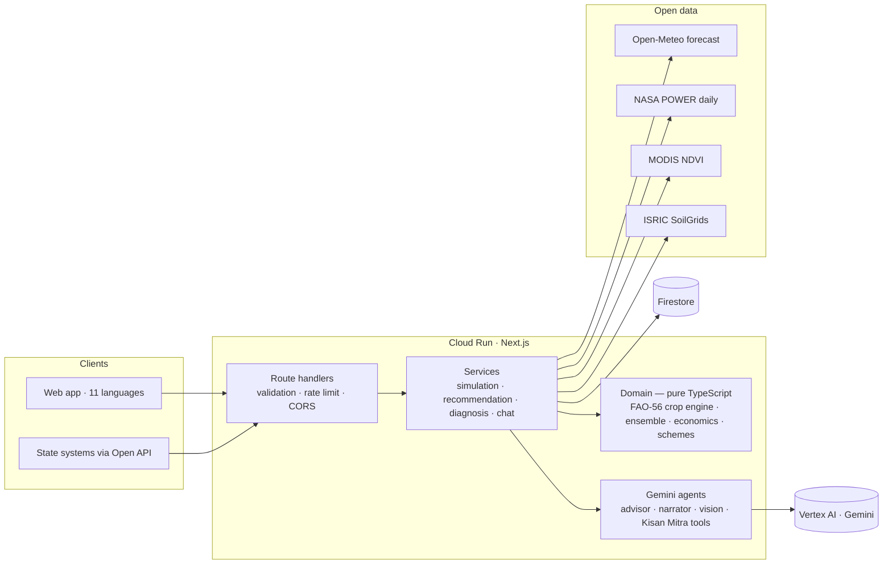

# KisanSetu — see your crop's whole season before you sow it

**An open, interoperable agro-advisory network for India's small and marginal farmers.**
Built for _Build with AI: Code for Communities_ (2nd edition), Track 4 — AgriN & Regenerative Agricultural Intelligence.

KisanSetu simulates every crop a farmer could sow on their field — using their soil, the live
weather forecast and ten years of satellite-derived weather — and shows which crop will pay in a
good _and_ a bad year, how much water it needs, what can go wrong and when, and how to grow it
regeneratively. Gemini explains every result in the farmer's language, diagnoses crop disease from a
photo, reads Soil Health Cards, and answers questions by voice.



|              |                                                                                                             |
| ------------ | ----------------------------------------------------------------------------------------------------------- |
| **Live app** | _to be added after the Cloud Run deployment_                                                                |
| **Open API** | [`/api/v1/openapi.json`](src/server/http/openapi.ts) — OpenAPI 3.1, generated from the code's own contracts |
| **Licence**  | Apache-2.0                                                                                                  |

---

## How it answers the Track 4 challenge

| Challenge asks for                                                  | KisanSetu                                                                                                                                                                                                 | Where                                                                                                               |
| ------------------------------------------------------------------- | --------------------------------------------------------------------------------------------------------------------------------------------------------------------------------------------------------- | ------------------------------------------------------------------------------------------------------------------- |
| Real-time, localised agro-advisories using AI                       | Field context from live forecast, satellite NDVI and soil maps; Gemini advisories grounded in model output, in 11 languages                                                                               | [`fieldContext.ts`](src/server/services/fieldContext.ts), [`advisor.ts`](src/server/ai/advisor.ts)                  |
| Regenerative crop recommendations                                   | Every candidate crop is simulated and ranked on profit, bad-year safety, water, soil health and stability; each gets an explained regenerative score and Gemini writes a field-specific regenerative plan | [`recommend.ts`](src/domain/agro/recommend.ts), [`regenerative.ts`](src/domain/agro/regenerative.ts)                |
| Based on satellite data                                             | NASA POWER (CERES radiation, MERRA-2, IMERG-corrected rain) drives a 10-year weather ensemble; MODIS Terra NDVI shows field greenness now vs a year ago                                                   | [`nasaPower.ts`](src/server/providers/nasaPower.ts), [`modis.ts`](src/server/providers/modis.ts)                    |
| Soil health                                                         | Soil Health Card values (typed or read from a photo by Gemini) or ISRIC SoilGrids 250 m; pH, salinity and nutrient limits enter the model and the costs                                                   | [`soilGrids.ts`](src/server/providers/soilGrids.ts), [`vision.ts`](src/server/ai/vision.ts)                         |
| Weather forecasting                                                 | Open-Meteo 16-day forecast overlaid on each ensemble member; forecast days are labelled as such in every view                                                                                             | [`openMeteo.ts`](src/server/providers/openMeteo.ts), [`scenarios.ts`](src/domain/agro/scenarios.ts)                 |
| Diagnostic tool for crop diseases                                   | Gemini multimodal diagnosis with recent-weather context, IPM-first treatment and escalation to KVK / Kisan Call Centre                                                                                    | [`CropDoctor.tsx`](src/features/doctor/CropDoctor.tsx)                                                              |
| Scalable digital public good; states share agricultural data models | Versioned crop-model registry with a published JSON schema, open API with CORS, anonymised network data, national district outlook                                                                        | [`registry.ts`](src/domain/crops/registry.ts), [`/network`](src/app/network/page.tsx), [`docs/DPG.md`](docs/DPG.md) |
| Multilingual / voice                                                | 11 Indian languages (UI in Anek, a type family designed for Indian scripts), voice questions and spoken answers via Gemini                                                                                | [`i18n/`](src/i18n), [`kisanMitra.ts`](src/server/ai/kisanMitra.ts)                                                 |

## What a farmer (or FPO officer) can do

- **Plan my crop** — pick the field, sowing date and water access; get every sowable crop ranked with
  profit ranges (bad year → good year), irrigation need, risk and soil score, a profit-against-water
  decision map, plus Gemini's explanation, regenerative plan and fertiliser advice. Plans can be shared
  by link.
- **Season simulator** — watch any crop's season unfold on a living field: the rows grow, flower and
  ripen from the model's height and canopy, rain and irrigation fall when the weather says so, and a
  soil cut-away shows water and roots. Field notes tell the farmer what to do on each date; charts,
  the last ten seasons, the water budget and the soil-health breakdown explain the outcome. Two crops
  can be compared side by side.
- **Crop doctor** — photograph a sick plant for a diagnosis and safe, low-cost treatment.
- **Kisan Mitra** — ask by voice or text; the agent calls the crop model, forecast and scheme rules as
  tools, so every number it speaks comes from the platform.
- **Schemes** — eligibility for 12 central schemes checked by deterministic rules, with the reason.
- **State dashboard** — model-based rabi outlook for 42 districts, typical profit by district,
  crop-health reports and the shared crop-model registry.

| Planner                                          | Season simulator                             |
| ------------------------------------------------ | -------------------------------------------- |
|  |  |

| Two crops side by side                                | State dashboard                                          |
| ----------------------------------------------------- | -------------------------------------------------------- |
|  |  |

Every plant in the app is drawn in code from the crop model's numbers — 21 crops, each with its own
form (awned wheat, drooping paddy, mustard bloom, groundnut pegs underground, cotton bolls) — so the
picture is always the data, never a stock photo. The simulator began as a prototype in Google AI
Studio and was rebuilt on the platform's crop model, art and design system.

## Architecture



The science lives in `src/domain` — pure, deterministic, fully unit-tested TypeScript with no I/O.
Services orchestrate open data and Gemini around it; route handlers are thin adapters. Every request,
response and AI output is validated against Zod contracts in `src/contracts`, which also generate the
OpenAPI document. Details: [docs/ARCHITECTURE.md](docs/ARCHITECTURE.md).

**AI does real work, and never invents the numbers.** The crop model computes yields, water and money;
Gemini ranks nothing and prices nothing. It explains, translates, sees (diagnosis, card reading), listens
and speaks, and plans regenerative practice — always grounded in the model's output and validated
against a schema before it reaches a farmer.

## The crop model in one paragraph

Each crop grows by thermal time through four FAO-56 stages; a daily root-zone water balance (FAO-56
single crop coefficient, growing roots, effective rainfall, drainage, stress coefficient Ks) responds to
the irrigation policy the farmer can actually follow. Yield follows FAO-33 (stage-weighted Ky) with
temperature, heat-at-flowering, frost, soil pH/salinity and maturity factors. The season is run across
ten historical years (with the real forecast on top), and profit is sampled across weather × price
scenarios using each crop's price volatility — so a farmer sees the bad year, not just the average.
Reference-evapotranspiration code reproduces FAO-56 worked examples in the tests. Full description and
limitations: [docs/MODEL.md](docs/MODEL.md).

## Google technologies

| Technology                                             | Used for                                                                                                                                         |
| ------------------------------------------------------ | ------------------------------------------------------------------------------------------------------------------------------------------------ |
| **Gemini 3.8 Flash on Vertex AI** (Gemini API locally) | Advisories, regenerative plans, narration & translation, crop-disease vision, Soil Health Card OCR, speech understanding, function-calling agent |
| **Gemini TTS**                                         | Spoken answers in Indian languages                                                                                                               |
| **Cloud Run**                                          | Single container, autoscaling, `asia-south1`                                                                                                     |
| **Firestore**                                          | Shared, anonymised network data and shareable plans                                                                                              |
| **Cloud Build / Artifact Registry**                    | Source-to-container builds for Cloud Run                                                                                                         |
| **Cloud Logging**                                      | Structured JSON logs with request ids                                                                                                            |

## Run it

```bash
npm install
cp .env.example .env.local        # optional: add GEMINI_API_KEY for the AI features
npm run dev                       # http://localhost:3000
```

Everything except the Gemini features works with zero configuration (in-memory storage, open data).

```bash
npm run check          # type-check + lint + unit tests
npm run test:coverage  # unit tests with coverage
npm run test:e2e       # Playwright end-to-end suite against a running app
npm run test:live      # live tests against the real data providers and Gemini
npm run data:outlook   # rebuild the 42-district national outlook
npm run i18n:translate # regenerate UI translations with Gemini
```

### Deploy to Cloud Run

```bash
PROJECT_ID=your-project REGION=asia-south1 ./scripts/deploy-cloud-run.sh
```

The script enables the APIs, creates a Firestore database and a least-privilege service account
(Vertex AI user, Datastore user, log writer) and deploys from source. No API keys are needed in
production: Gemini is reached through Vertex AI with the service account.

## Project structure

```
src/
  contracts/   Zod schemas: API, simulation, crop-model format, AI outputs (single source of truth)
  domain/      Pure logic: crop engine, ET0, soil, ensemble, economics, regenerative score, schemes
  server/      Providers (open data), Gemini agents, services, repositories, HTTP layer
  features/    UI by feature: planner, simulator, doctor, Kisan Mitra, schemes, network
  components/  Small design-system primitives
  i18n/        Typed messages (English source + 10 languages), translator
  app/         Next.js routes (pages and /api)
data/          Pre-computed national outlook and sample seasons
scripts/       Data builders, translation generator, deploy script
tests/         Test helpers, live tests, Playwright E2E
docs/          Architecture, model, DPG alignment, screenshots
```

## Quality

- Strict TypeScript; zero ESLint findings (Next.js + React 19 hook rules).
- 120+ unit tests covering the science (FAO-56 worked examples, water balance behaviour,
  ensemble statistics, ranking), contracts, i18n integrity, HTTP layer and OpenAPI generation;
  Playwright E2E for the main journeys; opt-in live tests against real providers and Gemini.
- CI on every push: lint, type-check, tests with coverage, production build, container smoke test.
- Resilience: provider timeouts, retries and caching with request coalescing; every open-data
  source degrades gracefully; AI failures never block the model's answer.
- Security & privacy: input validation everywhere, rate limiting, security headers, no personal data
  stored, coordinates rounded to ~10 km, prompt-injection-aware system prompts, least-privilege IAM.

## Honest limitations

- Crop parameters are national defaults; district-level calibration against KVK trial data is the
  intended next step (the model registry exists for exactly this).
- Vegetable prices are indicative mandi modal prices; live Agmarknet integration is future work.
- Phone (IVR/SMS) channels are planned integrations; this release covers web, voice-in-browser and API.
- UI translations other than English and Hindi are machine-generated and need native review.

## Credits

KisanSetu builds on the author's earlier projects: KisanSetu (Smart India Hackathon 2025 winner,
PS SIH25270 — oilseed value chain, MSP-based economics and scheme knowledge) and the KisanSetu advisory
prototype (Soil Health Card inputs, multi-agent crop planning, FPO/RSK workflow).
